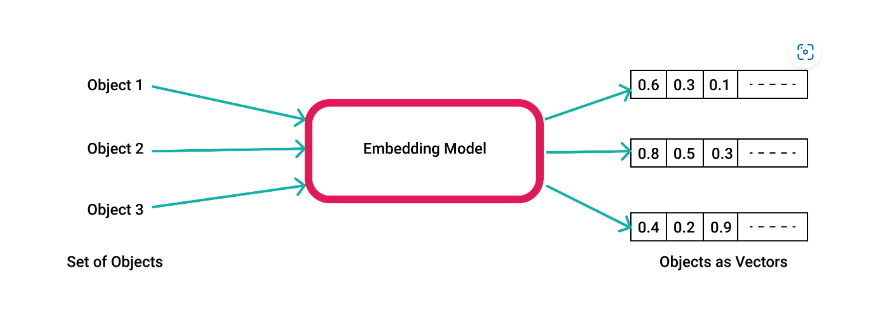
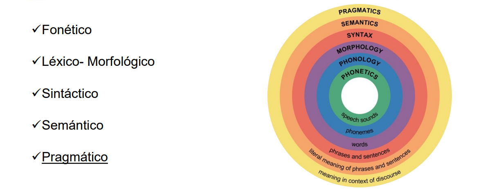

# Pinecone

## Embeddings

[What are Vector Embeddings | Pinecone](https://www.pinecone.io/learn/vector-embeddings/)

Los algoritmos de inteligencia artificial necesitan de numeros para trabajar, a este conjunto de datos lo conocemos como dataset, muchas veces nos encontramos con dataset bien ordenados con columnas de valores numericos (Orden, categorizacion, ...etc), pero otras veces tenemos datos complejos de tratar como lo son textos, libros o documentacion compleja, es en este momento en el que necesitamos una manera de extraer la informacion de un texto y convertirla en una representacion numerica para que nuestra inteligencia artificial pueda trabajar sobre esta.

El concepto de Embedding, nos da una solucion a este problema, comprimiendo nuestra informacion o texto en una reprecentacion numerica con la que nuestros modelos de ML puedan trabajar sobre ella.

Un párrafo completo de texto o cualquier otro objeto se puede reducir a un vector. Incluso los datos numéricos se pueden convertir en vectores para facilitar las operaciones.

Pero hay algo especial en los vectores que los hace tan útiles. Esta representación permite traducir la similitud semántica percibida por los humanos a la proximidad en un espacio vectorial.

Para clarar cuando nos enfrentamos a un problema de NLP (procesamiento de lenguaje natural), tenemos muchos paradigmas asociados entre ellos dependiendo de nuestro caso de estudio, como se ve en la imagen.

En nuestro caso, la similitud semántica o análisis semántico de un texto hace referencia a qué tan lejos estoy de una palabra a otra y crear una relación. Por ejemplo, en la frase: “El gato está sobre la mesa”, un análisis semántico implica conocer que el gato es un animal, que la mesa es un objeto plano y que el gato está sobre el objeto.

Este analisis crea clusters (Agrupacion de datos) de palabras similares por ejemplo puede crear un cluster de animales donde se encuentren palabras como: Raton, Conejo, Ardilla, ...etc, tambien de oraciones completas como: zoo de elefantes, acuario marino o Los elefantes le temen a los ratones. 

### Crear un embeddings

[Aprende sobre Embeddings de OpenAI - YouTube](https://www.youtube.com/watch?app=desktop&v=-XVkdIdli0I)

Para crear un embeddings tenemos que hacer uso de un motor para crearlos, en este caso usaremos el modelo de text-embedding-ada-002.

[embeddings.ipynb](./embeddings.ipynb)

#### Recursos

[puigalex/GPT3 (github.com)](https://github.com/puigalex/GPT3)

[Aprende sobre Embeddings de OpenAI - YouTube](https://www.youtube.com/watch?v=-XVkdIdli0I&t=902s)