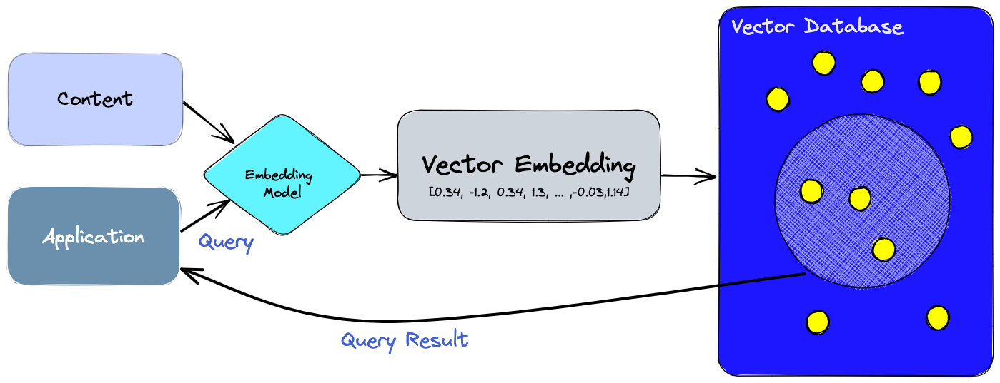

# Recursos

[Pinecon](https://www.pinecone.io/learn/vector-database/)

[AWS Que son las bases de datos vectoriales](https://aws.amazon.com/es/what-is/vector-databases/#:~:text=Las%20bases%20de%20datos%20vectoriales%20permiten%20a%20los%20desarrolladores%20innovar,impulsadas%20por%20la%20b%C3%BAsqueda%20vectorial.)

# Pinecone

## Embeddings

[What are Vector Embeddings | Pinecone](https://www.pinecone.io/learn/vector-embeddings/)

Los algoritmos de inteligencia artificial necesitan de numeros para trabajar, a este conjunto de datos lo conocemos como dataset, muchas veces nos encontramos con dataset bien ordenados con columnas de valores numericos (Orden, categorizacion, ...etc), pero otras veces tenemos datos complejos de tratar como lo son textos, libros o documentacion compleja, es en este momento en el que necesitamos una manera de extraer la informacion de un texto y convertirla en una representacion numerica para que nuestra inteligencia artificial pueda trabajar sobre esta.

El concepto de Embedding, nos da una solucion a este problema, comprimiendo nuestra informacion o texto en una reprecentacion numerica con la que nuestros modelos de ML puedan trabajar sobre ella.

Un párrafo completo de texto o cualquier otro objeto se puede reducir a un vector. Incluso los datos numéricos se pueden convertir en vectores para facilitar las operaciones.

Pero hay algo especial en los vectores que los hace tan útiles. Esta representación permite traducir la similitud semántica percibida por los humanos a la proximidad en un espacio vectorial.

Para clarar cuando nos enfrentamos a un problema de NLP (procesamiento de lenguaje natural), tenemos muchos paradigmas asociados entre ellos dependiendo de nuestro caso de estudio, como se ve en la imagen.

En nuestro caso, la similitud semántica o análisis semántico de un texto hace referencia a qué tan lejos estoy de una palabra a otra y crear una relación. Por ejemplo, en la frase: “El gato está sobre la mesa”, un análisis semántico implica conocer que el gato es un animal, que la mesa es un objeto plano y que el gato está sobre el objeto.

Este analisis crea clusters (Agrupacion de datos) de palabras similares por ejemplo puede crear un cluster de animales donde se encuentren palabras como: Raton, Conejo, Ardilla, ...etc, tambien de oraciones completas como: zoo de elefantes, acuario marino o Los elefantes le temen a los ratones. 

### Crear un embeddings

[Aprende sobre Embeddings de OpenAI - YouTube](https://www.youtube.com/watch?app=desktop&v=-XVkdIdli0I)

Para crear un embeddings tenemos que hacer uso de un motor para crearlos, en este caso usaremos el modelo de text-embedding-ada-002.

[embeddings.ipynb](./embeddings.ipynb)

#### Recursos

[puigalex/GPT3 (github.com)](https://github.com/puigalex/GPT3)

[Aprende sobre Embeddings de OpenAI - YouTube](https://www.youtube.com/watch?v=-XVkdIdli0I&t=902s)

## Bases de datos vectoriales

Las bases de datos vectoriales se utilizan normalmente para impulsar casos de uso de búsquedas vectoriales, como la búsqueda visual, semántica y multimodal. Más recientemente, se han combinado con modelos de texto de inteligencia artificial (IA) generativa para crear agentes inteligentes que proporcionan experiencias de búsqueda conversacional. También pueden evitar que los modelos de IA generativa tengan alucinaciones, lo que puede provocar que los chatbots proporcionen respuestas no fácticas pero creíbles.

Las bases de datos vectoriales tienen las capacidades de una base de datos tradicional y la especialización de tratar embeddings vectoriales, de la que carecen las bases de datos escalares tradicionales.

Con una base de datos vectorial, podemos añadir funciones avanzadas a nuestras IA, como recuperación de información semántica, memoria a largo plazo, etc. El diagrama siguiente nos permite comprender mejor el papel de las bases de datos vectoriales en este tipo de aplicaciones.

## Funcionamiento de pinecone

* En primer lugar, utilizamos el modelo de embeddings para crear embeddings vectoriales del contenido que queremos indexar.

* Los embeddings vectorial se inserta en la base de datos vectorial, con alguna referencia al contenido original a partir del cual se creó la incrustación.

* Cuando la aplicación realiza una consulta, utilizamos el mismo modelo de embeddings para crear embeddings para la consulta y las utilizamos para buscar embeddings vectoriales similares en la base de datos. Como ya se ha dicho, esos embeddings similares se asocian al contenido original que se utilizó para crearlas.

## Beneficios

Ofrece muchos beneficos, pero los más llamativos son

* ``Almacenamiento y filtrado de metadatos``: Las bases de datos vectoriales pueden almacenar metadatos asociados a cada entrada vectorial. Los usuarios pueden consultar la base de datos utilizando filtros de metadatos adicionales para realizar consultas más precisas.

* ``Escalabilidad``: Las bases de datos vectoriales están diseñadas para escalar con crecientes volúmenes de datos y demandas de los usuarios, proporcionando un mejor soporte para el procesamiento distribuido y paralelo.

* ``Integración en el ecosistema``: permite una fácil integración con otras herramientas relacionadas con la IA como LangChain, LlamaIndex, los plugins de ChatGPT y otros ecosistemas.

